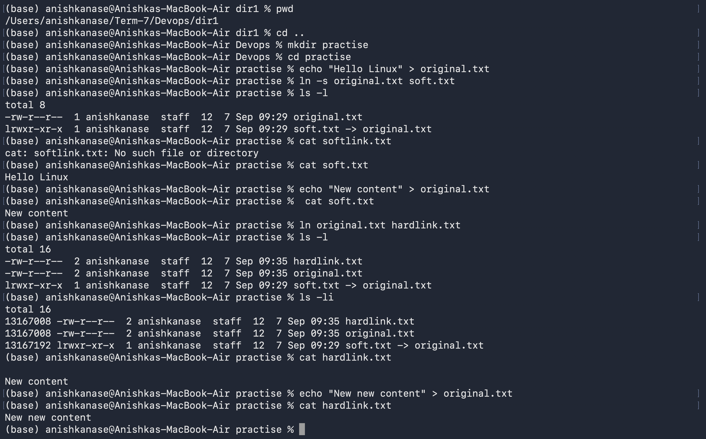
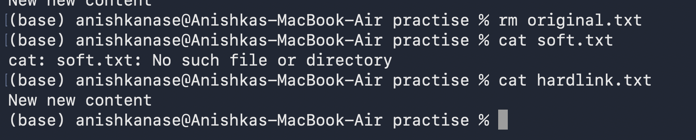

Linux Homework Tasks

Task 1: Soft Link & Hard Link
Learn the difference between soft links and hard links.
Learn the commands to create both.
Practice creating and deleting soft and hard links.
Prepare for this as an interview question.

SOFTLINK:
Softlink points to the original file, and if the original file is created, this also gets deleted. 
To create a soft link, we do "ln -s original.txt softlink.txt"  ln = link
On doing ls -l we get :
original.txt
softlink.txt -> original.txt

Means softlink is like a shortcut pointing to the original file. 
original.txt
    ↑
    │
softlink.txt
On changing contents of original file, contents of the softlink also gets changed. Deleting softlink.txt do not delete original file. 

HARDLINK:
Hardlink ifle and original file both points to the same inode or same data.
        ┌── original.txt
inode ──┤
        └── hardlink.txt 
To create a hard link, we do "ln original.txt hardlink.txt"
on doing ls -li, we get:
13167008 -rw-r--r-- 2 user user ... original.txt
13167008 -rw-r--r-- 2 user user ... hardlink.txt
Notice, that the inode number of both are same. 
Because they refer to the same underlying file, modifying either will modify other. 

The important difference comes when you delete the original. With a soft link, deleting the original makes the soft link broken because the link was pointing to that filename/path. With a hard link, deleting the original filename does not destroy the data because hard.txt still points to the same inode.

Inode is basically Linux's internal record for a file. It stores informations like permissions, owner, size, timestamps, and importantly, where its actual data is stored.
Not jus filename is identity of a file, the file points to an inode. 
To see inode numbers, use : ls -li

Task 2:
adduser vs useradd
Learn the difference between adduser and useradd.
Understand which command is preferred on Ubuntu/Linux and why.
Create a test user using the recommended command.

adduser lets us add user and also is interactive, it automatically asks for username, password, phone numbers,etc. 
But for useradd its not interactive, and we have to manually tell it to add password. 

adduser testuser : automatically creates /home/testuser

But for useradd testuser, it creates account, but you generally need to explicitly ask it to create the home directory:
useradd -m testuser2 : Here -m means create the user's home directory.

Thats why on doing ls /home, we just got testuser created using adduser, and we didnt get testuser2, created using useradd and didnt add it manually. 

After adding aa useradd user with (-m command) : useradd -m testuser2, when we do ls /home, we get all users. 

root@bbaef6d9488d:/# su - testuser3 => su means switch user
$ whoami
testuser3
$ pwd
/home/testuser3
exit

adduser is higher-level and user-friendly; useradd is lower-level and gives you more control, but you often need options like -m to create the home directory.

Task 3:
journalctl
Learn what journalctl is used for.
Learn how to view system and service logs using journalctl.
Practice checking logs for a specific service.

jounralctl : shows the system logs. 
journalctl -n 5 : to get last 5 lines of system logs entries
journalctl -u ssh : shows logs only belonging to SSH : -u means "for this systemd unit/service."
journalctl -u ssh -n 5 : last 5 ssh logs 

journalctl -u ssh -f: shows current live logs like we are monitoring a service, -f = follow the logs continuously.

Task 4: Linux Command Cheat Sheet
Review the Linux command cheat sheet.
Practice the important commands covered in the cheat sheet.
Understand the purpose and basic usage of each command.

mkdir project
root@bbaef6d9488d:~# ls        
project
root@bbaef6d9488d:~# cd project
root@bbaef6d9488d:~/project# ls
root@bbaef6d9488d:~/project# 