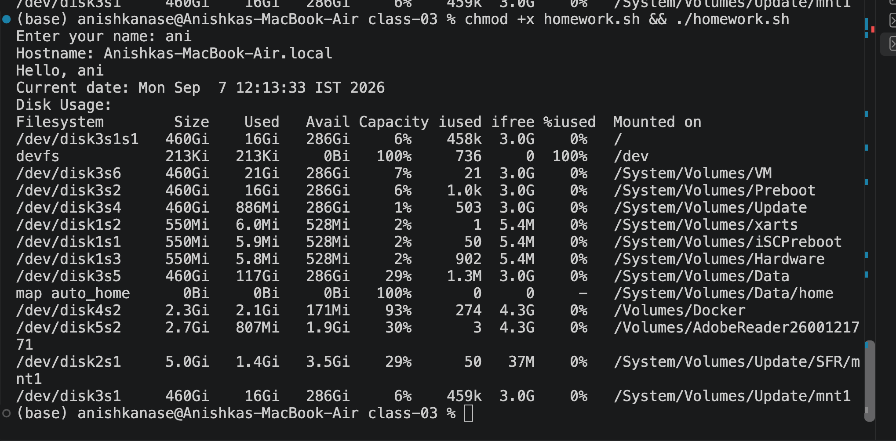

Shell Scripting Homework Task
Task: System Information Script
Create a shell script that:
Prints the current date.
Prints the hostname.
Prints the username.
Prints the disk usage.
Prints the running processes.
Uses variables to store and use data.
Takes user input using read -p.
Creates a directory using mkdir.
Creates a file using touch.
Stores the running processes information in the file using > output redirection.
Commands to Use
mkdir
touch
echo
df
ps
read -p
Variables
> output redirection

Script is :
#!/bin/bash
mkdir homework
read -p "Enter your name: " name

curr_date=$(date)

touch homework>processes.txt
ps > homework/processes.txt
hostname=$(hostname)

echo "Hostname: $hostname"
echo "Hello, $name"
echo "Current date: $curr_date"

# disk_usage=$(df -h)
touch homework>diskusage.txt

df -h > homework/diskusage.txt
echo "Disk Usage:"
df -h > homework/diskusage.txt
cat homework/diskusage.txt