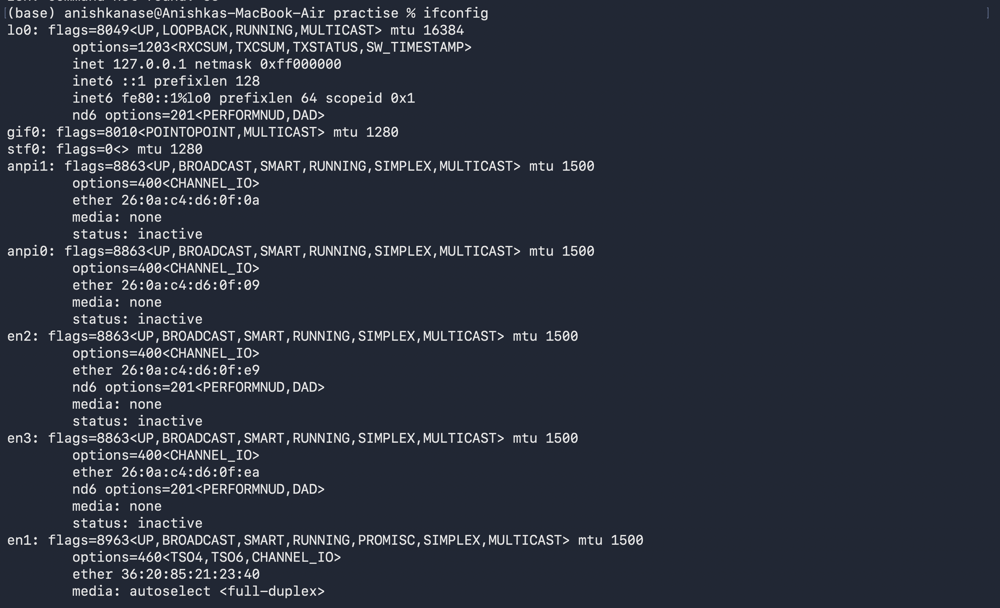
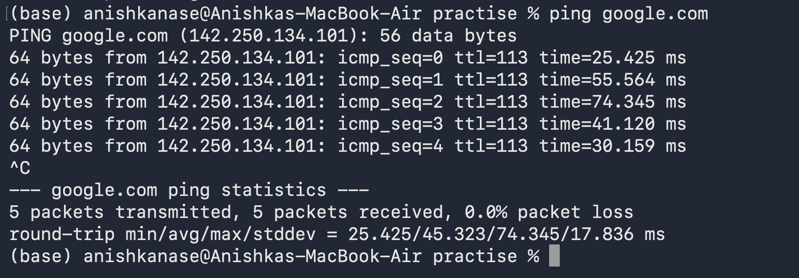
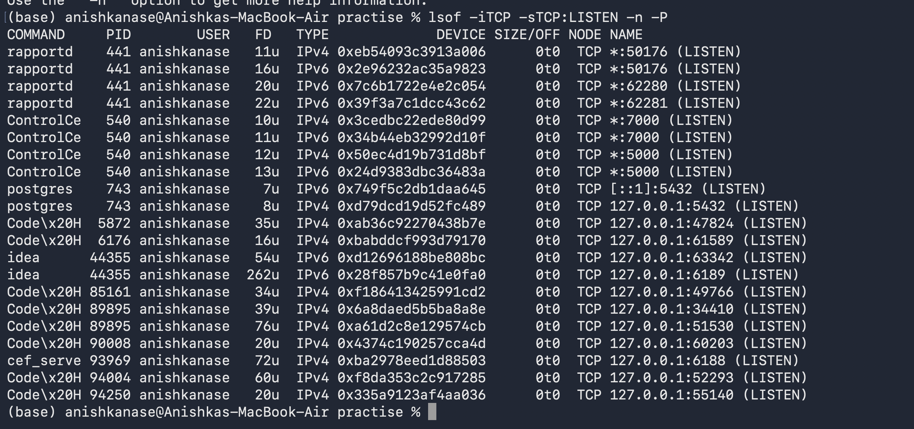
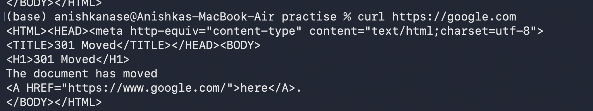
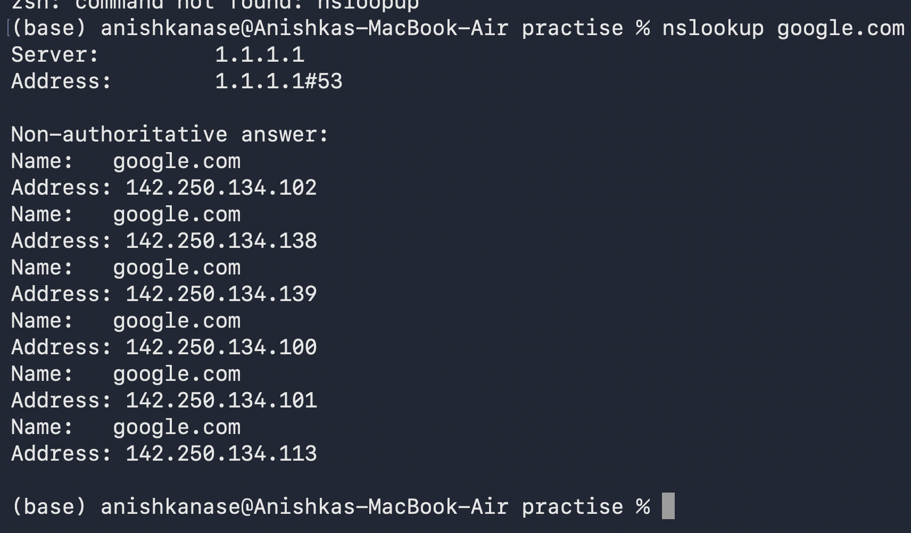
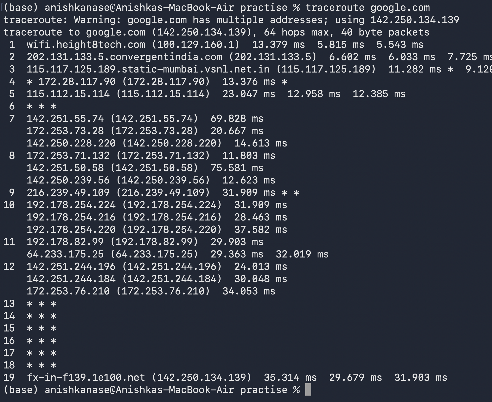

1. "ifconfig"

This showss network interfaces and their information.
It shows interface name, IP addresses, and active or not status of that interface. 
To get my active IPv4 address: look for "inet"

en0: flags=8863<UP,BROADCAST,SMART,RUNNING,SIMPLEX,MULTICAST> mtu 1500
	options=6460<TSO4,TSO6,CHANNEL_IO,PARTIAL_CSUM,ZEROINVERT_CSUM>
	ether 52:ed:6d:ed:97:31
	inet6 fe80::1810:d114:8789:ade0%en0 prefixlen 64 secured scopeid 0xc 
	inet 100.129.163.167 netmask 0xfffff000 broadcast 100.129.175.255
	nd6 options=201<PERFORMNUD,DAD>
	media: autoselect
	status: active

en0 : inet => 100.129.163.167 => This is my Mac's IPv4 address on current network.
en0 is Wi-Fi network interface 
status: active means this interface is conencted and being used currently

lo0: flags=8049<UP,LOOPBACK,RUNNING,MULTICAST> mtu 16384
	options=1203<RXCSUM,TXCSUM,TXSTATUS,SW_TIMESTAMP>
	inet 127.0.0.1 netmask 0xff000000
	inet6 ::1 prefixlen 128 
	inet6 fe80::1%lo0 prefixlen 64 scopeid 0x1 
	nd6 options=201<PERFORMNUD,DAD>

lo0 is the loopback interface and inet 127.0.0.1 means this computer itself. 

lo0
→ loopback
→ 127.0.0.1
→ my own computer

en0
→ Wi-Fi
→ 100.129.163.167
→ active

ipconfig getifaddr en0 this gives 100.129.163.167

2. ping

This means Im asking google are u reachable ? and also how long it takes to get a response from u ? Google responds and then ping measures the round-trip time
0.0% packet loss => How much packet loss. 
So ping shows time to reach google server and packet loss happened in the process. 

3. hostname: gives hostname, which is basically the name computer uses on the network. 

4. ss -tuln 
ss -tuln is commonly used on Linux to view listening TCP/UDP ports. Since macOS does not provide ss by default, I used lsof -iTCP -sTCP:LISTEN -n -P to view listening TCP ports.

lsof -iTCP -sTCP:LISTEN -n -P:

lsof: show open files/resources
iTCP: only TCP network connections
sTCP:LISTEN: only TCP ports waiting for connections
-n -P: show IPs/ports as numbers

5. curl : curl is command line tool, used to send a request to a URL, and then receive the output or response from the server.  
curl https://google.com : this connects with the cgoogle server, sends a HTTPS request and then receives the response from the server and displays it in the terminal. 

6. nslookup : This asks the DNS server about whats the IP address of google.com
nslookup is used to query DNS and find information such as the IP address associated with a domain name.

7. traceroute 
traceroute google.com 
traceroute: Warning: google.com has multiple addresses; using 142.250.134.139
traceroute to google.com (142.250.134.139), 64 hops max, 40 byte packets
 1  wifi.height8tech.com (100.129.160.1)  13.379 ms  5.815 ms  5.543 ms
 2  202.131.133.5.convergentindia.com (202.131.133.5)  6.602 ms  6.033 ms  7.7

What this signifies is: My computer makes a request to the google server, then how many hops the network travels from my computer till google, is shown here: 64 hops max, and this traceroute is basically the path taken. 
Mac -> Router -> ISP -> More routers -> Google

1  192.168.1.1
2  10.x.x.x
3  ...
Each line is a network hop, basically a router/device, which my packet passes on the way from your Mac to Google.

8. nc -vz google.com 443
Here nc means Netcat, a networking tool. -v means verbose, -z means just test the connection without sending data, google.com is the host, and 443 is the HTTPS port.

If it succeeds, it means your computer was able to establish a TCP connection to google.com on port 443.

nc (netcat) is a networking utility used to test connections to a specific host and port. I used `nc -vz google.com 443` to check whether a TCP connection could be established on port 443.