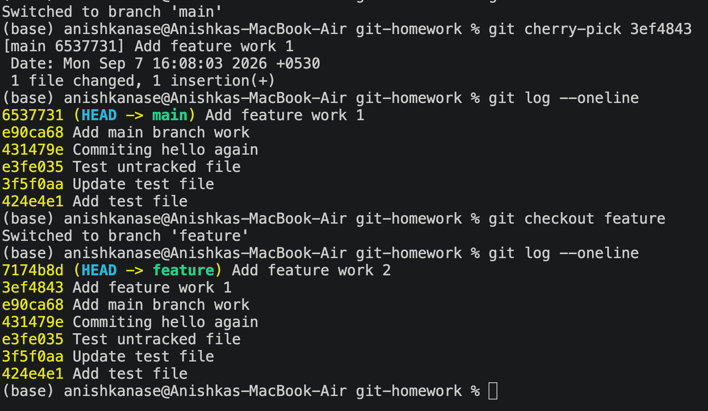

Git and GitHub
Task 1: git commit -a -m
Practice git commit -a -m "message".
Understand the difference between git commit -a -m and git commit -m.
Test both commands and observe the difference.

So now, when we do git add and then do commit, it works. But when we do git commit without adding, it will show error like : On branch main
Changes not staged for commit:
  (use "git add <file>..." to update what will be committed)
  (use "git restore <file>..." to discard changes in working directory)
        modified:   new.txt

But instead of that if we do git commit -a -m, then it gets committed. 

But one condition is that, the file should be already tracked by git, it shoulnt be a new file in whole. Any updates can be committed without adding it to stage via git commit -a -m, but not any content which are of a newly created file and that file isnt under Git track. 

"" Now lets understand: Working directory, staging Area, Git History. ""

Now all files and folders are the working directory and its independent of git. 
When i do git init, Im basically telling Git:
"Start managing/version-controlling this existing folder."
It creates .git; it doesn't move your files into Git.                 Your folder
                     │
       ┌─────────────┴─────────────┐
       ↓                           ↓
Working Directory                "".git""
(your actual files)         (Git's information)
       │                           │
       │                           ├── commits
       │                           ├── branches
       │                           ├── history
       │                           └── staging information
       │
       ├── test.txt
       ├── app.py
       └── new.txt

Now lets come to staging Area, now when i do git add, it gets added to staging area, which basically represents that these are the chnages or modifications i want to include in my next commit. So,git add will bring it to staging area, now Git History, so this basically has all commits, after committing all commits go in git history. 
Now git commit -m : will put to git history only and only the staged changes, but git commit -a -m will automatically stage it and commit it. 
-a = already-tracked files

added file and content in it => Working direc knows this
Now I did git init, git will add .git.
Now did git add => This will bring it to staging area, 
Now i did thit commit => this will bring it to Git History
I can skip git add, and directly do git commit -a -m(Given its not a new file and content has jus been updated). 

Task 2: Git Cherry-Pick
Create 2–4 commits in the main branch.
Use git log to view the commits.
Create a new branch.
Make 2–3 commits in the new branch.
Use git log to identify a specific commit.
Cherry-pick one specific commit from the new branch into the main branch.
Verify that the selected commit/change is now available in the main branch.
Submission
Take screenshots of your work or create an .md file showing the commands and output.
Upload the screenshots or .md file to the GitHub repository.

Now what happens here is: We made 2-3 commits on main branch and then went to a new branch and made 2-3 commits. 
Now git log --oneline will show the previous commits in main and the commits of the current feature branch as well. 
eg: (174b8d (HEAD -> feature) Add feature work 2
3ef4843 Add feature work 1
e90ca68 (main) Add main branch work)

Now from that 2-3 commits, we jus need 1 commit into the main branch. So we will take its commit id, and do: 
git cherry-pick 3ef4843

Git will jus take 3ef4843 and make a new commit in main 
Git takes the changes from commit 3ef4843 that were made on feature and created a new commit on main containing those changes.
and also the 3ef4843 will have a different commit id in main, bcs its a new commit and not the original one.

feature → 3ef4843 Add feature work 1
main    → 6537731 Add feature work 1

