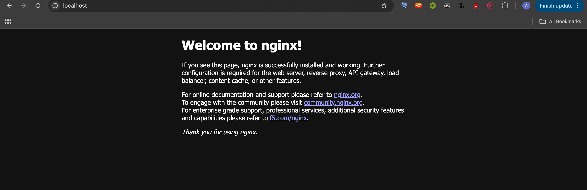

1. docker pull nginx
2. docker images
3. docker image inspect nginx
4. docker tag nginx mynginx.v1
5. docker rmi nginx
6. docker image prune

<!-- to run : docker run -it -d -p 80:80 nginx -->

apache java python nodejs

                DO I ALREADY HAVE THE IMAGE I NEED?
                         │
                  ┌──────┴──────┐
                 YES            NO
                  │              │
                  ▼              ▼
            docker pull      docker build
                  │              │
                  │              ▼
                  │        create my image
                  │              │
                  └──────┬───────┘
                         ▼
                    docker run
                         │
                         ▼
                     Container