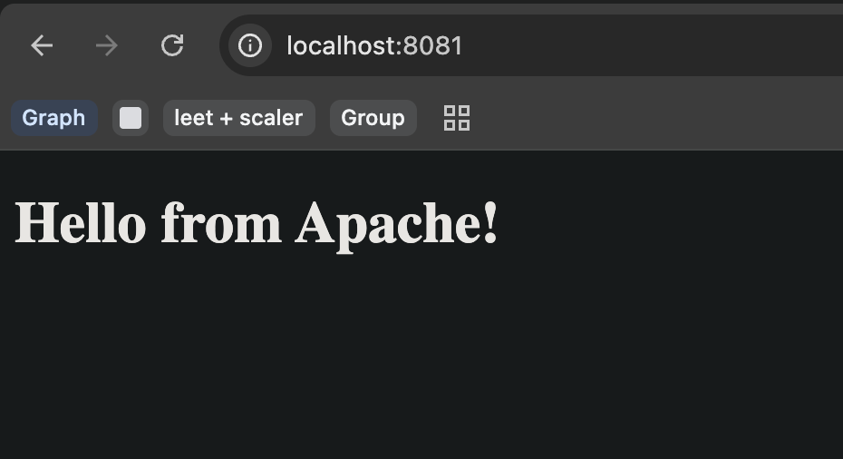
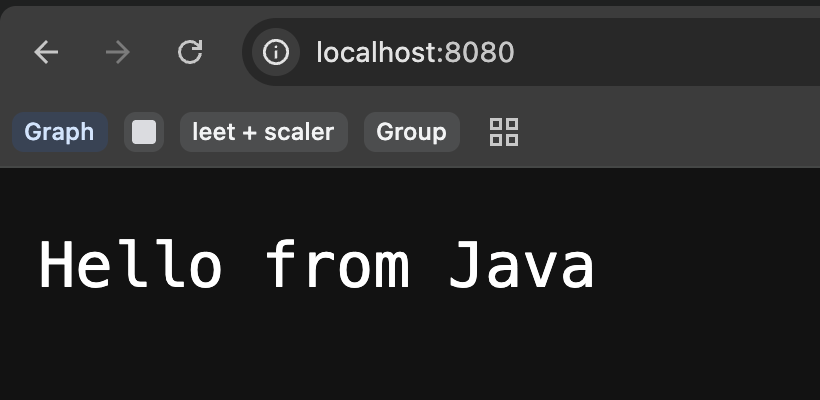
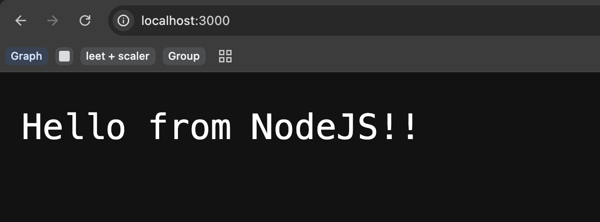
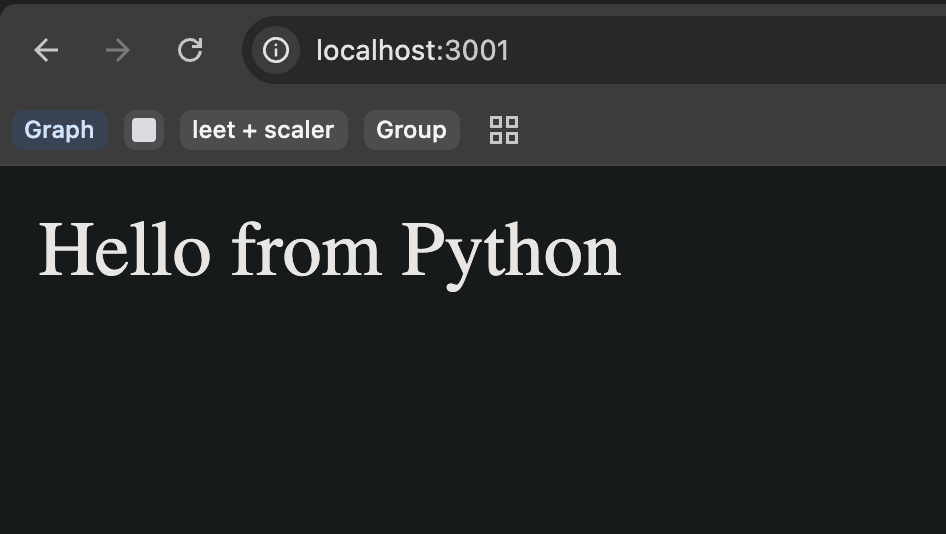
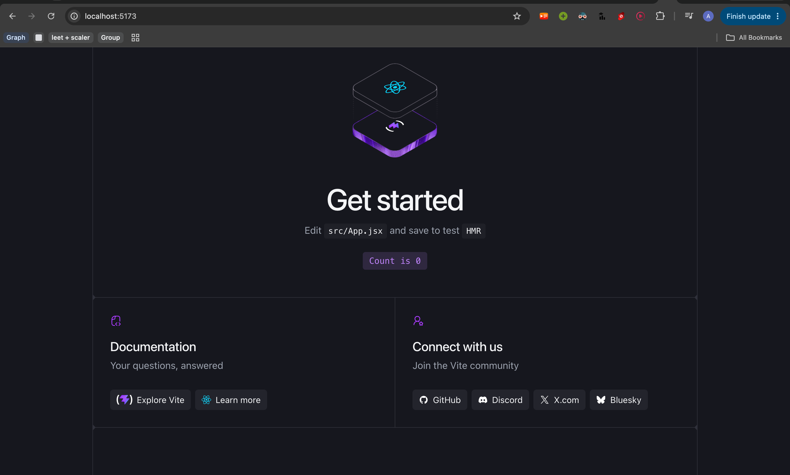
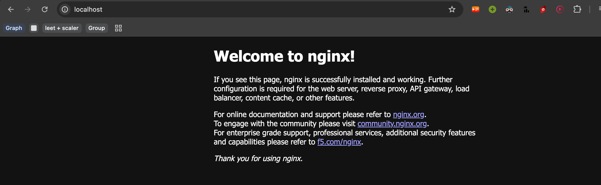

Docker Images

# Now Nodejs didnt need requirements.txt, because it built-in http module, but in Oython we're using Flask
# We need Flask or HTTP, because application must be a web application and you need to see "Hello World" in a browser, print("Hello World") will jsu print inside terminal, and not in browser. 

Application       Common/default port
-------------------------------------
Apache            80
Nginx             80
Node.js           3000
Python Flask      5000
Java HTTP server  8080
React/Vite        5173

Apache:  

Java: 

NodeJS: 

Python: 

React: 

Nginx: 