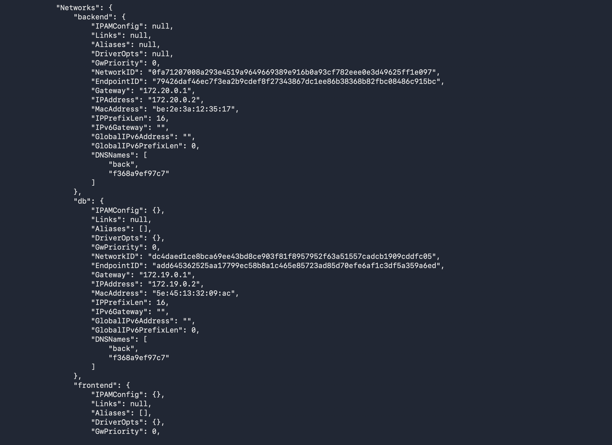
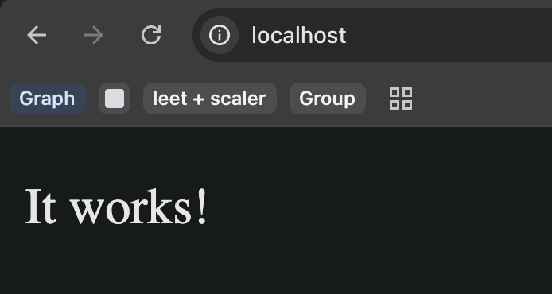
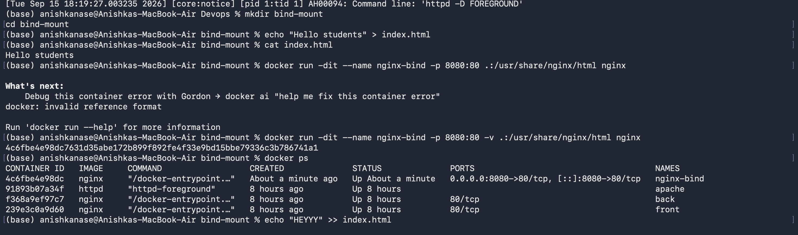

Task 1: Docker Container Networking
Create 3 containers:
Frontend
Backend
Database
Use Nginx or Alpine images for the frontend and backend.
Use the MySQL image for the database.
Create 3 different Docker networks.
Add the backend container to 2 networks.
Check connectivity between the containers.

// create networks
docker network create frontend
docker network create db
docker network create backend

// connect the network with containers
docker run -dit --name front --network frontend nginx
docker run -dit --name back --network backend nginx
docker run -d --name database --network db -e MYSQL_ROOT_PASSWORD=root123 mysql:8

// connect the networks with the backend container
docker network connect frontend back
docker network connect db back

// debugging commands
docker ps
docker network ls
docker inspect back
docker network inspect frontend
docker network inspect backend
docker network inspect db

Task 2: Host Network
Pull the Apache2 image from Docker Hub.
Create an Apache2 container using the host network.
Access the Apache website directly on port 80

Task 3: Bind Mount
Create a folder on your local machine.
Create an index.html file with Hello students as the content.
Bind mount the folder to an Nginx container.
Access the Nginx website and verify the content.
Modify the index.html file.
Verify that the changes are reflected without restarting the container.

mkdir bind-mount
cd bind-mount

echo "Hello students" > index.html

cat index.html

docker run -dit --name nginx-bind -p 8080:80 -v .:/usr/share/nginx/html nginx

docker ps

