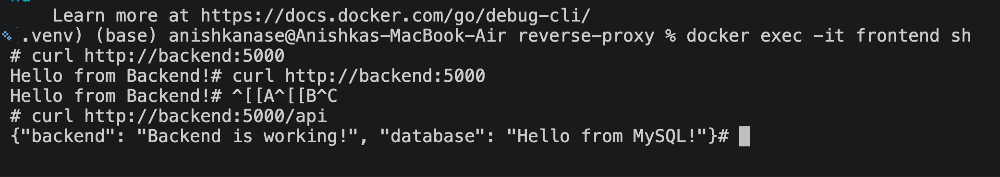
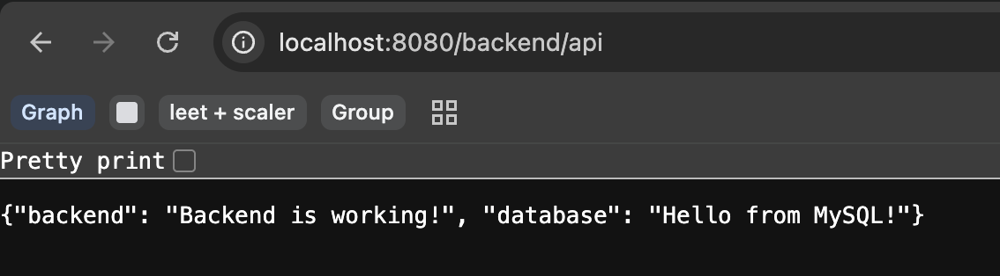
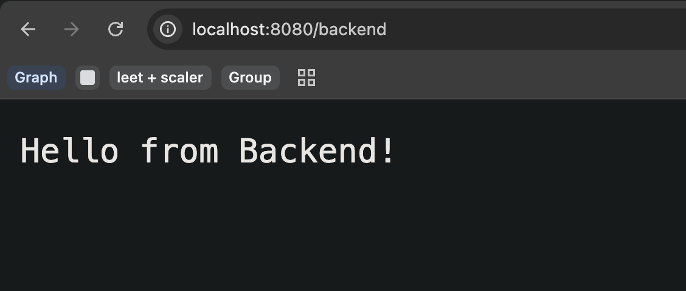

Now in the docker compose file inside reverse-proxy, the by default network is reverse_proxy_default, using the file name, and everything created are inside the same network, so therefore, frontend can talk to "backend" whcih is the container name itself. No need to specify IP address, etc. because compose makes them under same network. 
and also i used volumes because 
We are using bind mounts here because your index.html and nginx.conf already exist on my Mac, and I want the Nginx container to use those files directly.

Your Mac                                  Nginx container

-v ./frontend/index.html:/usr/share/nginx/html/index.html
./frontend/index.html  ───────────────→  /usr/share/nginx/html/index.html

-v ./frontend/nginx.conf:/etc/nginx/conf.d/default.conf
./frontend/nginx.conf  ────────────────→ /etc/nginx/conf.d/default.conf

Without bind mount, the Nginx container wouldnt know about my local conf file. 

reverse-proxy/
│
├── backend/
│   ├── server.py
│   └── Dockerfile
│
└── frontend/
    ├── index.html
    └── nginx.conf

3 containers: backend, frontend, and database. 
Now we want both shd be on same docker network : reverse_proxy_deafult
Then Docker allows the frontend to reach the backend using: backend

                Docker
┌─────────────────────────────────────────────┐
│                                             │
│  frontend container                         │
│  Nginx :80                                  │
│       │                                     │
│       │ backend:5000                        │
│       ↓                                     │
│  backend container                          │
│  Python :5000                               │
│                                             │
└─────────────────────────────────────────────┘
          ↑
          │
   localhost:8080
          ↑
       Browser

