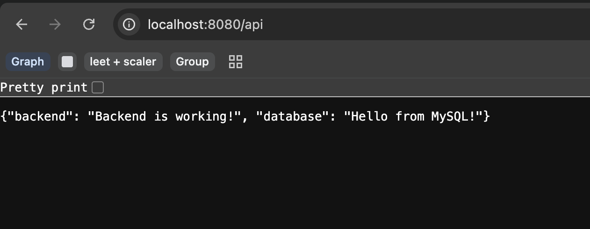
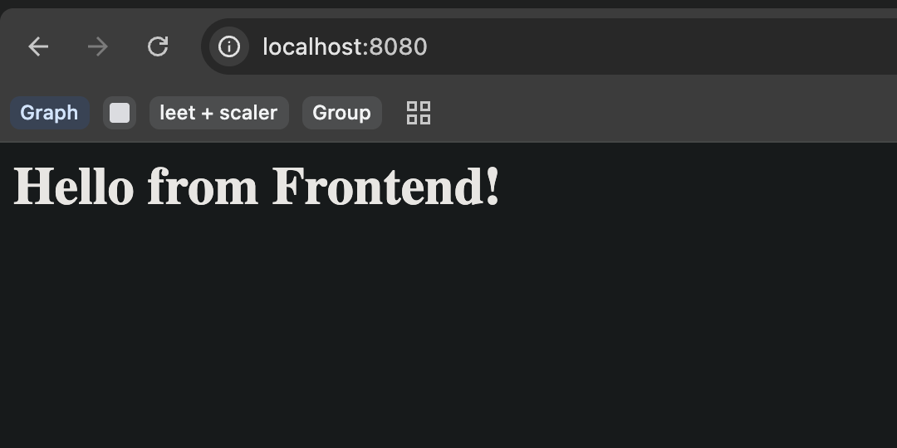

Yes, you're understanding it correctly. Let me first give you the 13-step summary, then clear up the two outputs.

### Reverse Proxy — 13-step summary

1. Create the project:

```bash
mkdir reverse-proxy
cd reverse-proxy
mkdir frontend backend
```

2. Create the backend application in:

```text
backend/server.py
```

3. Create the backend Dockerfile:

```text
backend/Dockerfile
```

4. Create a Docker network:

```bash
docker network create reverse-proxy-net
```

5. Build the backend image:

```bash
docker build -t my-backend ./backend
```

6. Run the backend:

```bash
docker run -d --name backend --network reverse-proxy-net my-backend
```

Notice: no `-p 5000:5000`.

7. Create your frontend:

```text
frontend/index.html
```

8. Create Nginx configuration:

```text
frontend/nginx.conf
```

with:

```nginx
location /api {
    proxy_pass http://backend:5000/api;
}
```

9. Run Nginx:

```bash
docker run -d --name frontend --network reverse-proxy-net -p 8080:80 -v ./frontend/index.html:/usr/share/nginx/html/index.html -v ./frontend/nginx.conf:/etc/nginx/conf.d/default.conf nginx
```

10. Open:

```text
http://localhost:8080
```

This reaches the Nginx frontend.

11. Open:

```text
http://localhost:8080/api
```

This reaches Nginx first, and Nginx forwards the request to:

```text
backend:5000/api
```

12. Test backend directly from inside the frontend container:

```bash
docker exec -it frontend /bin/bash
curl http://backend:5000
curl http://backend:5000/api
```

13. Test from your Mac:

```bash
curl http://localhost:5000
```

should fail because backend port 5000 was never published, while:

```bash
curl http://localhost:8080/api
```

works through Nginx.

### Now your first doubt: Is `frontend` a container of the Nginx image?

Yes.

When you run:

```bash
docker run -d --name frontend ... nginx
```

you are creating a **container named `frontend` from the `nginx` image**.

So:

```text
Image:
nginx

        ↓ docker run

Container:
frontend
```

The name `frontend` is just the name you gave the container. The actual software running inside it is Nginx.

So you can think:

```text
frontend = container
nginx = image/software inside that container
```

The same idea applies to backend:

```text
my-backend = image
backend = container
```

### Your second understanding is also correct

You said:

> frontend/nginx can access backend using `backend:5000`

Yes.

Because both containers are on:

```text
reverse-proxy-net
```

Docker's internal DNS lets Nginx resolve:

```text
backend
```

to the backend container's IP.

So:

```text
Nginx container
      ↓
backend:5000
      ↓
Backend container
```

But the browser cannot directly use:

```text
backend:5000
```

because `backend` is a Docker-internal hostname. Your browser is outside that Docker network.

Instead:

```text
Browser
   ↓
localhost:8080/api
   ↓
Nginx container
   ↓
backend:5000/api
   ↓
Backend container
```

That's exactly the reverse proxy idea.

### Now the confusing part: why are there TWO outputs?

You saw:

```json
{"backend": "Backend is working!", "database": "Hello from MySQL!"}
```

and:

```text
Hello from Backend!
```

These come from **two different URLs in the Python backend code**.

We created the backend so that:

```text
GET / 
```

returns:

```text
Hello from Backend!
```

while:

```text
GET /api
```

returns:

```json
{
  "backend": "Backend is working!",
  "database": "Hello from MySQL!"
}
```

So when you do:

```bash
curl http://backend:5000
```

you're asking for the backend's **root path `/`**.

Therefore:

```text
Hello from Backend!
```

When you do:

```bash
curl http://backend:5000/api
```

you're asking for the **`/api` endpoint**.

Therefore:

```json
{"backend": "Backend is working!", "database": "Hello from MySQL!"}
```

The JSON is just a response containing two pieces of information. In our simple demo, `"backend": "Backend is working!"` proves the backend is responding, and `"database": "Hello from MySQL!"` is just a placeholder string in this exercise—it is **not actually coming from MySQL yet**.

So the clean mental model is:

```text
http://backend:5000
        ↓
Hello from Backend!


http://backend:5000/api
        ↓
{
  "backend": "Backend is working!",
  "database": "Hello from MySQL!"
}
```

And through Nginx:

```text
Browser
   │
   │ localhost:8080/api
   ↓
Nginx
   │
   │ proxy_pass
   ↓
backend:5000/api
   │
   ↓
JSON response
```

One subtle but very important point: **Nginx is not the backend and the frontend isn't literally "using Nginx to become the backend."** Nginx is acting as the middleman/reverse proxy. The backend remains a separate container and service.




