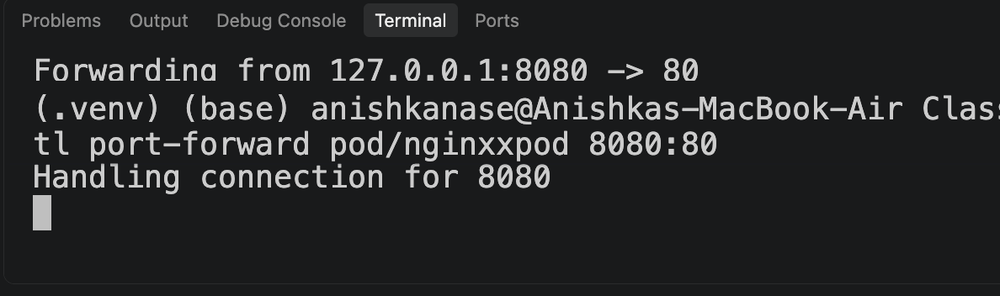
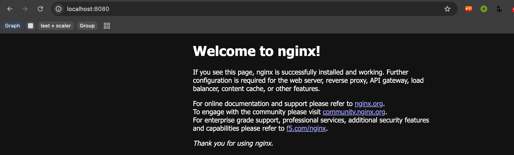

    - containerPort: 80
    # this is always 80, bcs Nginx always listens on port 80 inside the pod. 
    # port-forwarding: kubectl port-forward pod/nginx-pod 8080:80 => localhost:8080 => this will make 
    # all requests coming to 8080 transport to port 80, on which Nginx is listening.  

so basically what happens is:
when we create a pod and apply it, a pod gets created, and then inside that pod, we have container, now if its an nginx image's container, the containerPort will always be port 80, because nginx listens on port 80
then when i want to see the inside pod container, then i will do localhost, now here localhost means that the request will come to my laptop server, and then from there it will be forwarded to whatever from port x in my laptop to port 80 inside pod.
now lets set x,eg: x = 8080
localhost:8080 

now, prot forwarding will be done from 8080 of my laptop to port 80 of pod. 
kubectl port-forward pod/nginx-pod 8080:80

And this is why  restartPolicy: Never  matters here. Without it the default is  Always , so
Kubernetes would see the container exit, restart it, watch it exit again — forever. You'd get 
CrashLoopBackOff  on a pod that is working perfectly.  Never  tells Kubernetes "finishing is the
point."

so wihtout command and no restartPolicy: Never, this will show this error, 
because it will keep on retrying on again and again. 
either keep restartPolicy: never or keep cmd, without both its CrashLoopBackOff
