    - containerPort: 80
    # this is always 80, bcs Nginx always listens on port 80 inside the pod. 
    # port-forwarding: kubectl port-forward pod/nginx-pod 8080:80 => localhost:8080 => this will make 
    # all requests coming to 8080 transport to port 80, on which Nginx is listening.  

so basically what happens is:
when we create a pod and apply it, a pod gets created, and then inside that pod, we have container, now if its an nginx image's container, the containerPort will always be port 80, because nginx listens on port 80
then when i want to see the inside pod container, then i will do localhost, now here localhost means that the request will come to my laptop server, and then from there it will be forwarded to whatever from port x in my laptop to port 80 inside pod.
now lets set x,eg: x = 8080
localhost:8080 

now, prot forwarding will be done from 8080 of my laptop to port 80 of pod. 
kubectl port-forward pod/nginx-pod 8080:80

And this is why  restartPolicy: Never  matters here. Without it the default is  Always , so
Kubernetes would see the container exit, restart it, watch it exit again — forever. You'd get 
CrashLoopBackOff  on a pod that is working perfectly.  Never  tells Kubernetes "finishing is the
point."

so wihtout command and no restartPolicy: Never, this will show this error, 
because it will keep on retrying on again and again. 
either keep restartPolicy: never or keep cmd, without both its CrashLoopBackOff

HOMEWORK
01. Rolling Update
Create Deployment
Configure rolling update
Perform an application update
Verify old and new Pods

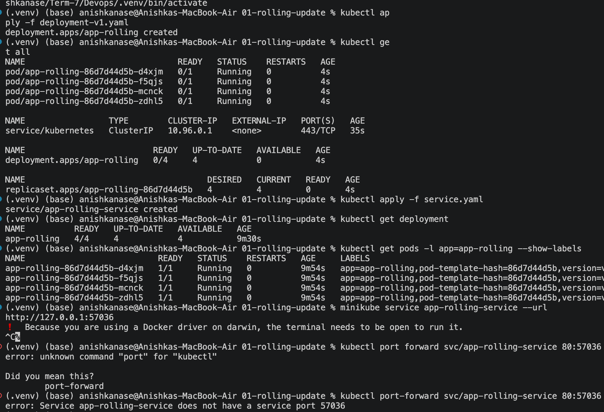
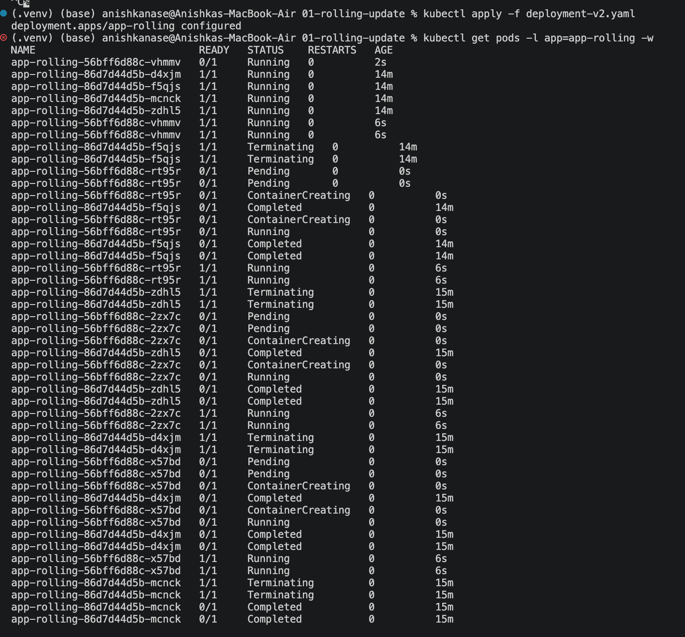
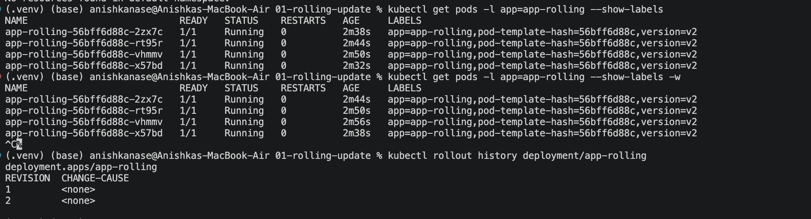
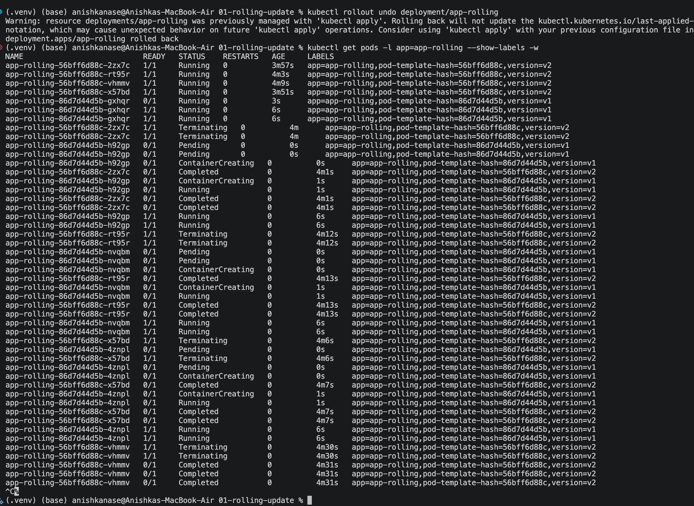
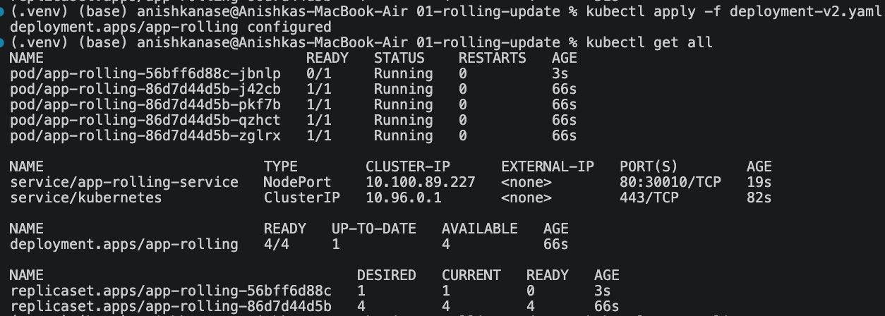
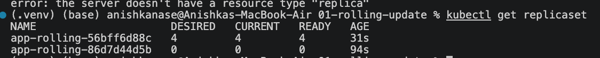

02. Blue-Green Deployment
Create Blue version
Create Green version
Switch traffic between versions => just apply the other service. 
Verify the active version => verify using describe, describe the service

Blue-Green does not update Pods gradually. Both versions are already running. The switch happens by changing the Service selector from slot=blue to slot=green.
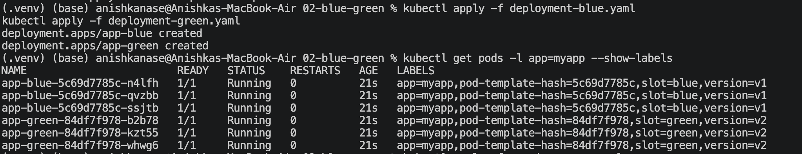
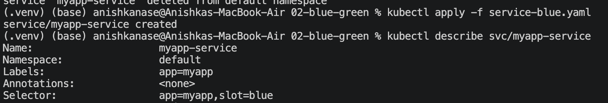
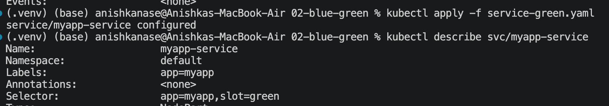

03. Canary Deployment
Deploy stable version
Deploy canary version
Route a small percentage of traffic to Canary
Verify both versions

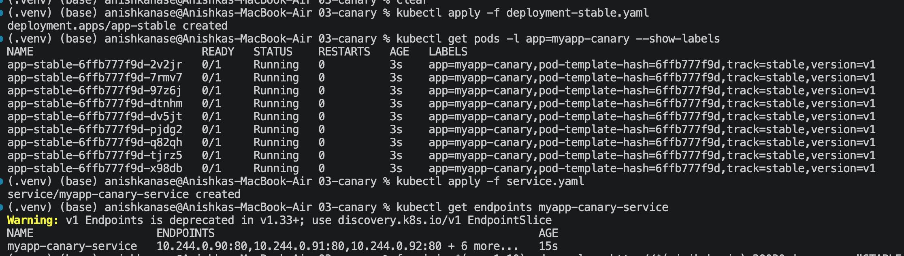
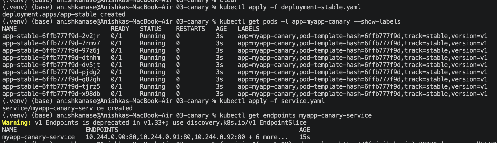
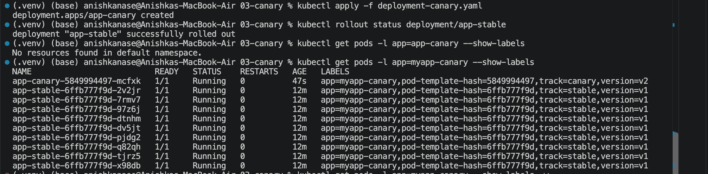
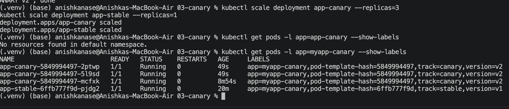
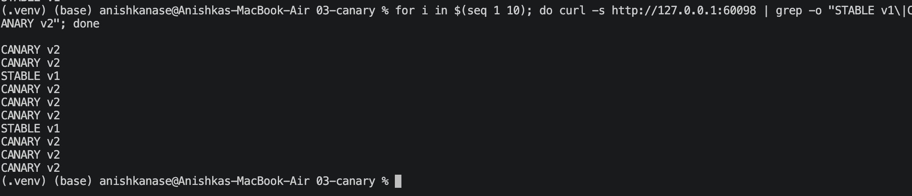

04. Recreate Deployment
Deploy the application
Update the application
Observe the old Pods being terminated before new Pods are created

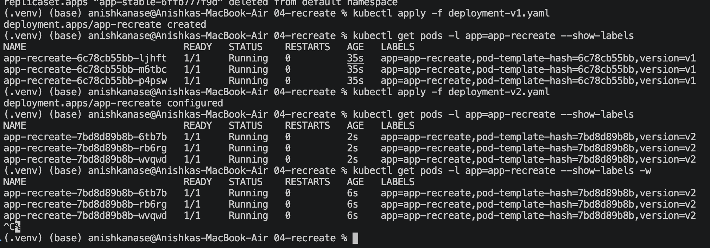
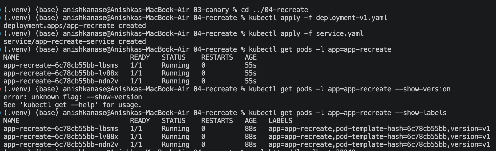
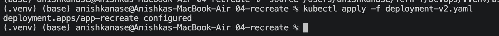
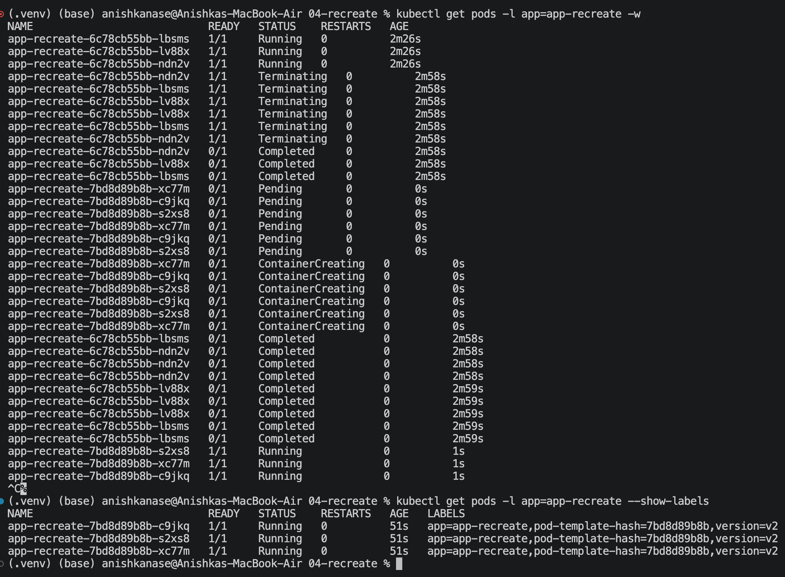
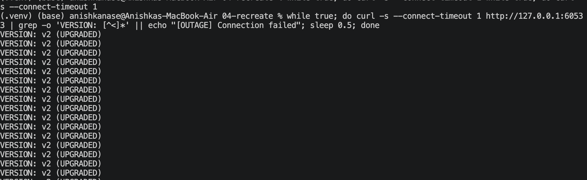
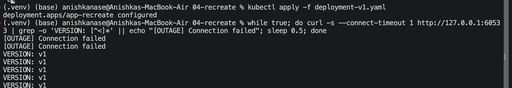

Task 2: Pod Lifecycle

Study and demonstrate the Kubernetes Pod lifecycle.

For each YAML file:
Apply the YAML file.
Check Pod status.
Check Pod details.
Capture the output.
Add the screenshot to README.md.
Explain what you observed.

