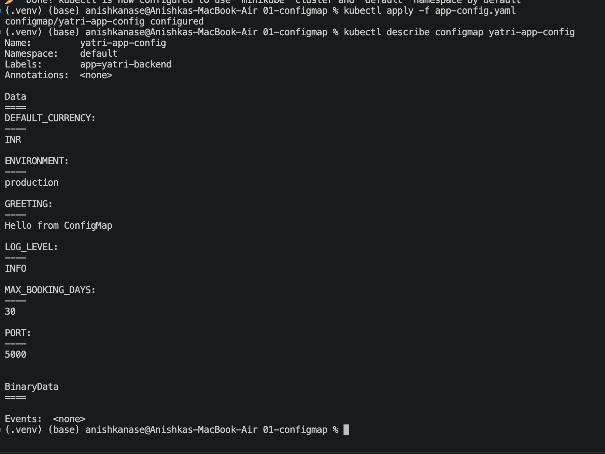
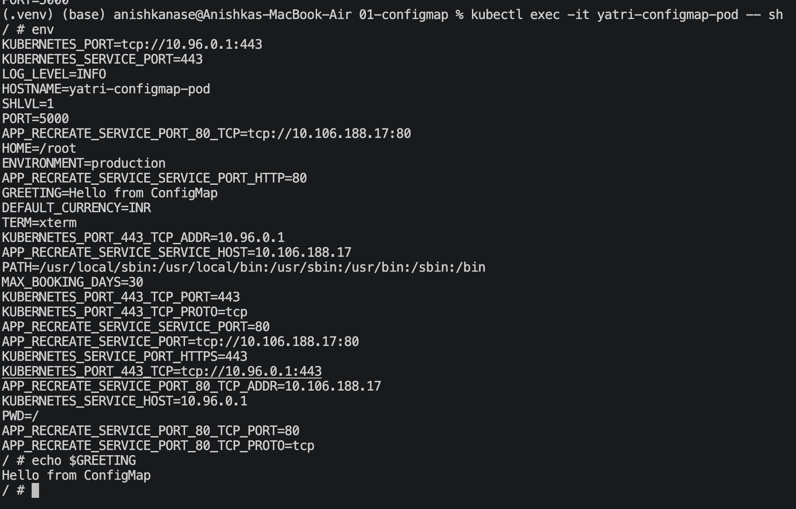
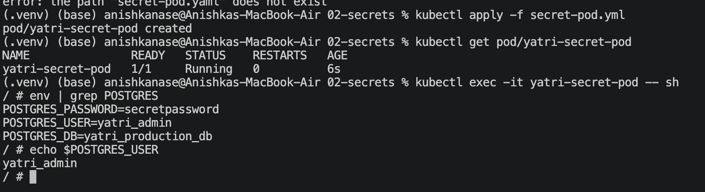
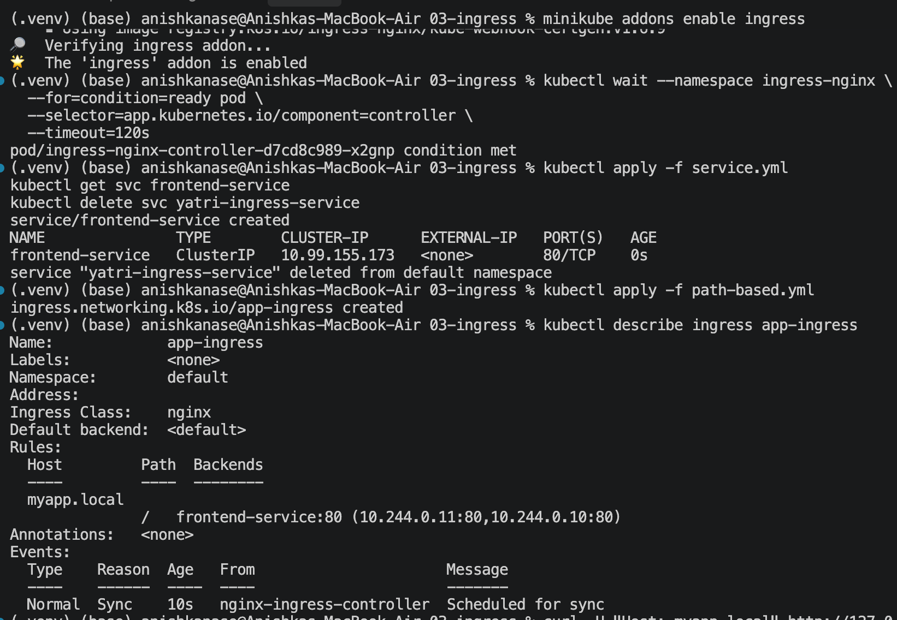

echo -n "Anishka" | base64 => QW5pc2hrYQ==
echo -n "QW5pc2hrYQ==" | base64 --decode => Anishka

Task 1: ConfigMap
Perform a complete hands-on demo:
Create ConfigMap
Store configuration values
Inject ConfigMap into Pod
Verify values inside the container

Verifying values inside the container:
This image shows that the config map values are read by the pod, and going inside the pod proves this. 

Task 2: Secret
Perform a complete hands-on demo:
Create Secret
Store sensitive values
Inject Secret into Pod
Verify the value inside the container
Understand why Secrets should not be committed directly to Git

env | grep POSTGRES => Shows all variables under data, including their values.

Why not commit Secrets directly to Git? Anyone with access to a committed manifest may be able to recover the credentials, even if the values are Base64-encoded. Keep real credentials out of Git; use an appropriate secret manager and cluster access controls for production.

Task 3: Ingress
Perform a complete Ingress demo:
Deploy application
Create Service
Configure Ingress
Access application through Ingress
Verify routing

Task 4: Ingress vs Ingress Controller
Create a README.md explaining:
What is Ingress?
What is an Ingress Controller?
Difference between them
Why both are required
Examples

Whats the difference between Ingress and Ingress Controller. 
An **Ingress** is a Kubernetes object that contains the **rules for routing incoming HTTP/HTTPS traffic** to different Services. For example, it can say that requests coming to `yatri.local/api` should go to the backend Service, while requests to `yatri.local/` should go to the frontend Service. Ingress itself does not handle the traffic; it is basically a set of routing instructions.

An **Ingress Controller** is the actual software that **implements those Ingress rules and handles the incoming traffic**. For example, when you run `minikube addons enable ingress`, Minikube installs the **NGINX Ingress Controller**. The controller watches your Ingress objects, reads their rules, receives incoming requests, and forwards them to the appropriate Kubernetes Services. So, in one line: **Ingress = routing rules, Ingress Controller = software that actually executes those rules.**

Task 5: Troubleshooting
Use the troubleshooting folder and:
Identify the problem.
Run troubleshooting commands.
Find the root cause.
Fix the issue.
Capture before/after output.
Add screenshots to README.md.
