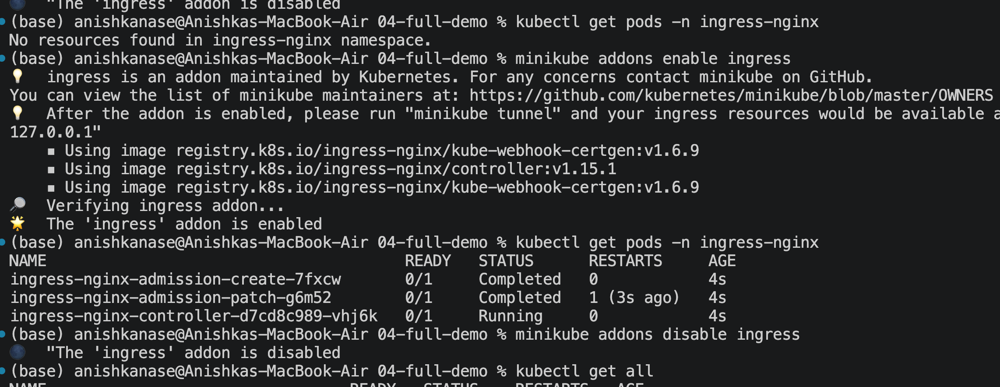
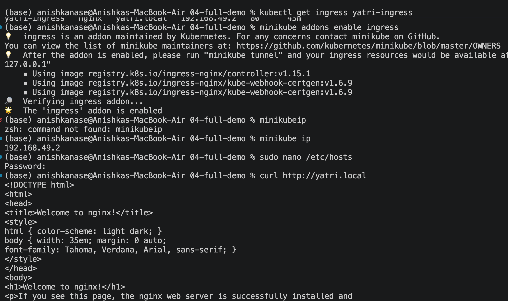

echo -n "Anishka" | base64 => QW5pc2hrYQ==
echo -n "QW5pc2hrYQ==" | base64 --decode => Anishka

Whats the difference between Ingress and Ingress Controller. 

An **Ingress** is a Kubernetes object that contains the **rules for routing incoming HTTP/HTTPS traffic** to different Services. For example, it can say that requests coming to `yatri.local/api` should go to the backend Service, while requests to `yatri.local/` should go to the frontend Service. Ingress itself does not handle the traffic; it is basically a set of routing instructions.

An **Ingress Controller** is the actual software that **implements those Ingress rules and handles the incoming traffic**. For example, when you run `minikube addons enable ingress`, Minikube installs the **NGINX Ingress Controller**. The controller watches your Ingress objects, reads their rules, receives incoming requests, and forwards them to the appropriate Kubernetes Services. So, in one line: **Ingress = routing rules, Ingress Controller = software that actually executes those rules.**
