TASK-1:

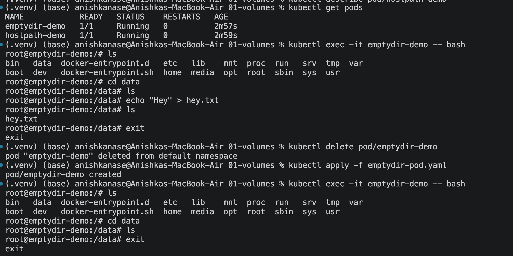
empty-dir is a temporary storage, once lifecyle of pod ends(created, running, delete)entire storage we have with empty-dir gets deleted.
If we create smthg inside data dir, it will get deleted once pod gets deleted. 

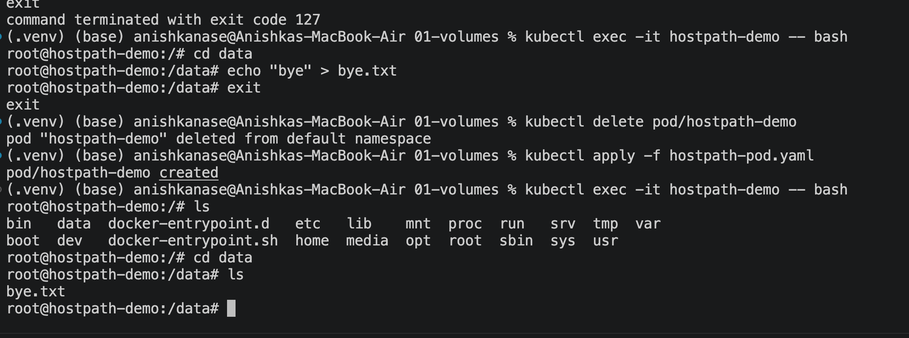
Also, we cant directly apply once we change the volume path (mountPath), we will have to delete that pod and then apply it. 

emptyDir: Kubernetes creates an empty directory when the Pod is created. The directory belongs to that Pod's lifetime. When you delete the Pod, Kubernetes deletes its emptyDir data. When you create a new Pod, Kubernetes creates a fresh, empty directory.

hostPath: Our hostpath file YAML mounts /tmp/hostpath-data from the Kubernetes node into the container at /data. The directory exists independently of the Pod. When you delete and recreate the Pod on the same node, it mounts the same directory again, so the file can still be there.

The key difference is that emptyDir belongs to the Pod, whereas hostPath points to a directory on the node.

PV(storage/capacity): this is like a hard disk, which will be the storage we have, inside a cluster. eg: Persistent vol = 20GB
PVC: Node will claim storage from PV. eg: Pod will claim 500mb of storage from PV. This is the space used by a POD only, and inside that used by any container, service(db, frontend, backend, etc.) => This is PVC. 

A service will have to do all these:
1. search which types of pvc it will have to use
2. search which types of pv it will have to use
There will be many pv,pcs. Searching is lengthy. 

So, we use "claimPloicy", add jus one term:   "storageClassName: standard"
This will create the pv automatically, no need to manually create pv file. 
This is Dynamic provisioning

Think of a StorageClass as a storage menu/instruction sheet that tells Kubernetes what kind of storage to create and who should create it.
This helps us avoid the manual creation of PV, and checks the storage class and automatically asks the provisioner to create the PV. 

Task 2: HPA Hands-on

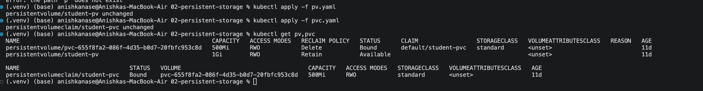
NAME                                                        CAPACITY   ACCESS MODES   RECLAIM POLICY   STATUS      CLAIM                 STORAGECLASS   VOLUMEATTRIBUTESCLASS   REASON   AGE
persistentvolume/pvc-655f8fa2-086f-4d35-b0d7-20fbfc953c8d   500Mi      RWO            Delete           Bound       default/student-pvc   standard       <unset>                          11d
persistentvolume/student-pv                                 1Gi        RWO            Retain           Available                                        <unset>                          11d

NAME                                STATUS   VOLUME                                     CAPACITY   ACCESS MODES   STORAGECLASS   VOLUMEATTRIBUTESCLASS   AGE
persistentvolumeclaim/student-pvc   Bound    pvc-655f8fa2-086f-4d35-b0d7-20fbfc953c8d   500Mi      RWO            standard       <unset>                 11d

So now, the ikuebctl top pods will tell us about how much utilization of memory each pod is using. EG:
NAME                                 CPU(cores)   MEMORY(bytes)   
app-recreate-6c78cb55bb-8pzc2        0m           7Mi             
app-recreate-6c78cb55bb-ncwd6        0m           9Mi    

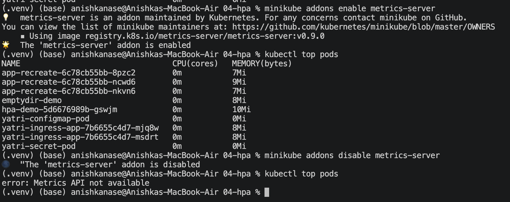

Why do we need Metrics Server? Because HPA needs to know application's current CPU usage to know whether we need more pods or not. The Metrics Server will collect this info from the Kubernetes nodes and make it available through the Kubernetes Metrics API. kubectl top pods uses that API to display CPU and memory usage.

HPA: Horizontal Pod AutoScaler
Jus mention the min and max replicas we want to scale, set boundaries, use HPA, this will automatically scale the replicas as per the no of users. 

kubectl run load-generator \
  --image=busybox:1.36 \
  --restart=Never \
  -- /bin/sh -c \
  "while true; do wget -q -O- http://hpa-demo-service; done"
This is the load generator

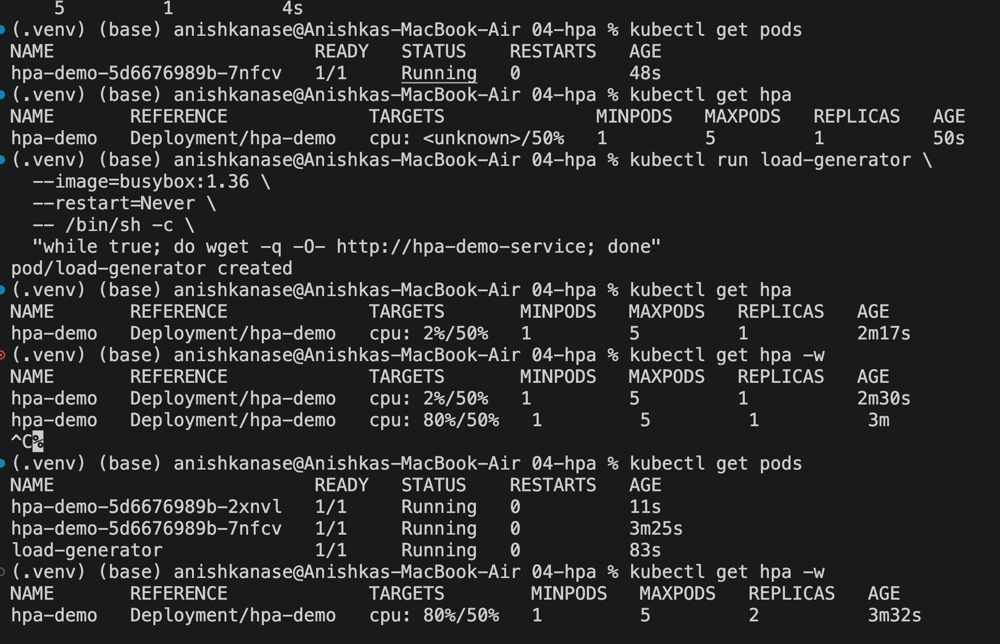
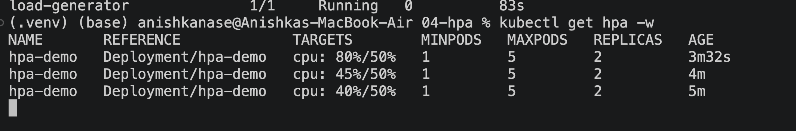
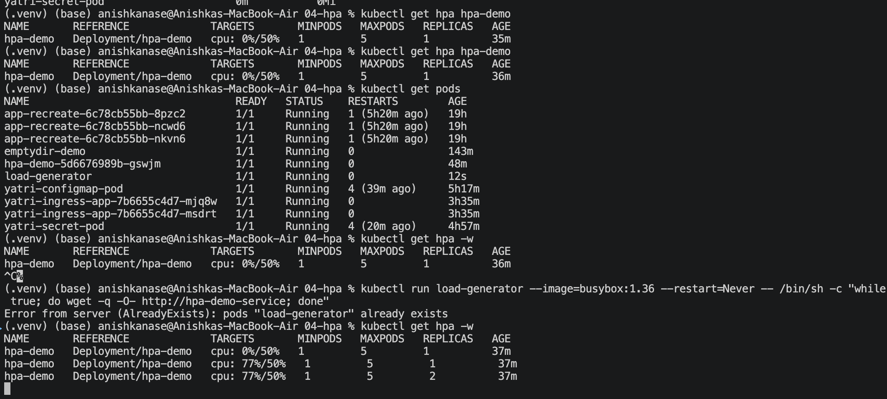

kubectl top pods: BEFORE Load Generator
NAME                                 CPU(cores)   MEMORY(bytes)   
app-recreate-6c78cb55bb-8pzc2        0m           7Mi             
app-recreate-6c78cb55bb-ncwd6        0m           9Mi             
app-recreate-6c78cb55bb-nkvn6        0m           7Mi             
emptydir-demo                        0m           8Mi             

kubectl top pods:  AFTER Load Generator
NAME                        CPU(cores)   MEMORY(bytes)   
hpa-demo-5d6676989b-2xnvl   40m          8Mi             
hpa-demo-5d6676989b-7nfcv   40m          8Mi             
load-generator              796m         7Mi             

BEFORE
kubectl get hpa hpa-demo
NAME       REFERENCE             TARGETS       MINPODS   MAXPODS   REPLICAS   AGE
hpa-demo   Deployment/hpa-demo   cpu: 0%/50%   1         5         1          35m

AFTER
kubectl get hpa -w
NAME       REFERENCE             TARGETS       MINPODS   MAXPODS   REPLICAS   AGE
hpa-demo   Deployment/hpa-demo   cpu: 0%/50%    1         5         1          37m
hpa-demo   Deployment/hpa-demo   cpu: 77%/50%   1         5         1          37m
hpa-demo   Deployment/hpa-demo   cpu: 77%/50%   1         5         2          37m
hpa-demo   Deployment/hpa-demo   cpu: 43%/50%   1         5         2          38m

We can see the autoscaler has increased the pod. count from 1 to 2 and further...
77%/50%: CPU utilization exceeded the 50% target, so HPA increased replicas from 1 to 2.

SO all commands to test HPA:
After applying service and depolyment
1. minikube addons enable metrics-server
2. kubectl top pods (initially all 0)
3. kubectl get hpa <hpa-name> initially 0 cpu usage
4. Create Load by deploying load generator by this command: 
kubectl run load-generator --image=busybox:1.36 --restart=Never -- /bin/sh -c "while true; do wget -q -O- http://hpa-demo-service; done"

Scaling down the load generator deployment: kubectl delete pod load-generator
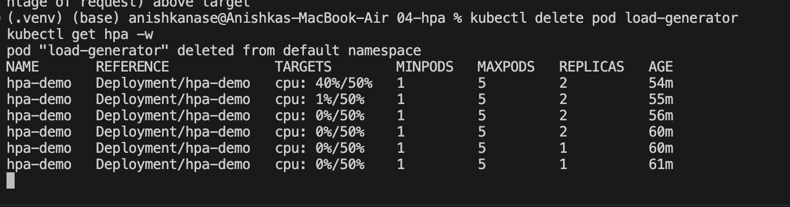
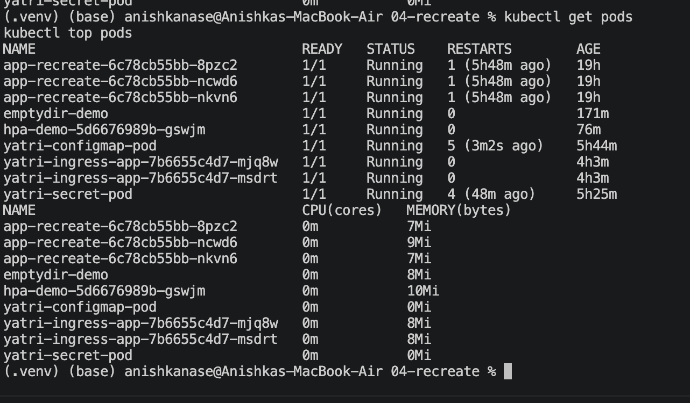

Task 3: Mini Project

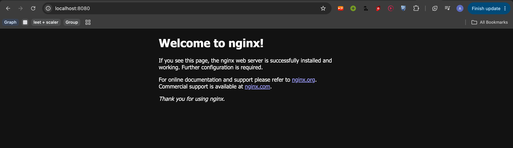
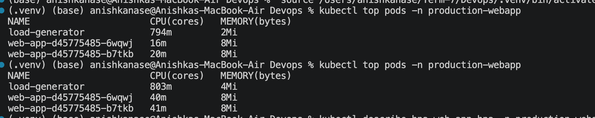
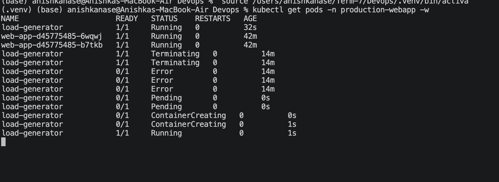
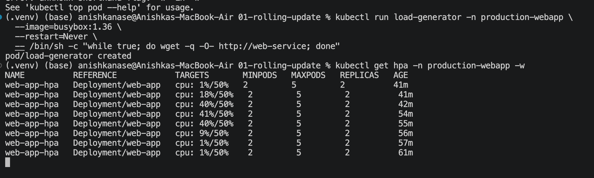
