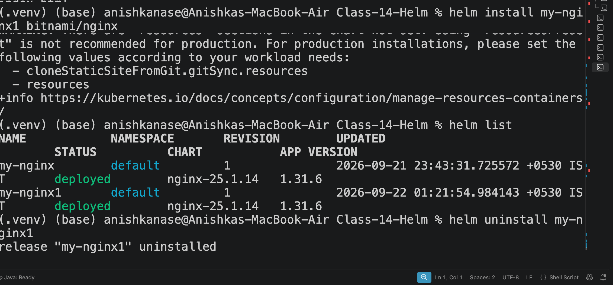

HELM: 

helm version → check Helm installation/version
helm list → see installed releases
helm repo add → add a chart repository
helm repo update → update the local repository index
helm install → install a chart and create a release
helm uninstall → remove a release
helm create → create your own Helm chart skeleton

1. Install Helm
curl -fsSL -o get_helm.sh https://raw.githubusercontent.com/helm/helm/main/scripts/get-helm-4
chmod 700 get_helm.sh
./get_helm.sh

curl -fsSL -o get_helm.sh <URL>
Downloads the Helm installation script from the official Helm GitHub repository and saves it as get_helm.sh.

chmod 700 get_helm.sh
Gives the owner permission to read, write, and execute the script.

./get_helm.sh
Runs the installation script and installs Helm.

2. Check Helm Version
helm version

Shows the installed Helm version and information about the Helm/Kubernetes client.

Example:

Version: v4.3.0
KubeClientVersion: v1.37

This is useful for verifying that Helm is installed correctly.

3. List Helm Releases
helm list

Shows the Helm releases currently installed in the current namespace.

Example:

NAME       NAMESPACE   REVISION   STATUS
my-nginx   default     1          deployed

Important distinction:

Chart     → Package/template
Release   → An installed instance of that chart

For example:

helm install my-nginx bitnami/nginx

Here:

bitnami/nginx → Chart
my-nginx      → Release name
4. Add a Helm Repository
helm repo add bitnami https://charts.bitnami.com/bitnami

Adds the Bitnami Helm chart repository.

A Helm repository is basically a place from which Helm can obtain charts.

After adding this repository, charts can be referenced like:

bitnami/nginx

Here:

bitnami → repository name
nginx   → chart name
5. Update Helm Repositories
helm repo update

Downloads the latest information about charts from the repositories that have been added.

Think of it as:

Helm repository
       ↓
helm repo update
       ↓
Latest chart information
6. helm install Syntax

The basic syntax is:

helm install <release-name> <chart>

Example:

helm install my-nginx bitnami/nginx

Meaning:

my-nginx       → name given to the release
bitnami/nginx  → chart being installed

The incorrect command was:

helm install my-nginx bitnami/nginx nginx

It failed because an extra argument (nginx) was provided.

7. Install NGINX from Bitnami
helm install my-nginx bitnami/nginx

This installs the nginx chart from the Bitnami repository.

Helm creates a release called:

my-nginx

So the relationship is:

Bitnami Repository
       ↓
nginx Chart
       ↓
helm install
       ↓
my-nginx Release
       ↓
Kubernetes resources

After installation, Helm showed:

STATUS: deployed
REVISION: 1

REVISION: 1 means this is the first deployed version of that release.

8. Check Installed Releases
helm list

After installing NGINX, the output contained:

my-nginx    default    1    deployed    nginx-25.1.14

This confirms that the Helm release exists and is deployed.

9. Release Names Must Be Unique

Running:

helm install my-nginx bitnami/nginx

again produced:

cannot reuse a name that is still in use

A release name cannot be reused while that release already exists.

For example:

my-nginx  → already exists ❌

A different release name can be used:

my-nginx1 → available ✅
10. Install Another Release
helm install my-nginx1 bitnami/nginx

This installs the same NGINX chart again, but creates a separate release:

my-nginx1

Therefore, multiple releases can use the same chart:

                 nginx chart
                /           \
               ↓             ↓
          my-nginx        my-nginx1
          release          release

Each release can have its own configuration and Kubernetes resources.

11. List Releases Again
helm list

At this point there were two releases:

my-nginx
my-nginx1

Both came from:

bitnami/nginx
12. Uninstall a Helm Release
helm uninstall my-nginx1

Removes the Helm release named:

my-nginx1

The Kubernetes resources created as part of that release are also removed.

Important:

helm uninstall <release-name>

not:

helm uninstall <chart-name>

So:

helm uninstall my-nginx1

is correct because my-nginx1 is the release name.

13. Uninstall the Other Release
helm uninstall my-nginx

Removes the other NGINX release.

At this point, both NGINX releases have been removed.

14. Verify Releases
helm list

An empty result means there are no currently installed Helm releases in the namespace being listed.

Creating a Custom Helm Chart
15. Create a Helm Chart
helm create demo-chart

Creates a basic Helm chart directory called:

demo-chart/

The generated structure was:

demo-chart/
├── Chart.yaml
├── charts/
├── templates/
└── values.yaml

These are the basic components of a Helm chart.

Chart.yaml
Contains metadata about the chart.

values.yaml
Contains default configuration values.

templates/
Contains Kubernetes YAML templates.

charts/
Used for chart dependencies.

16. Enter the Chart Directory
cd demo-chart

Moves into the newly created Helm chart directory.

Then:

ls

lists the files and directories inside it.

17. View Chart.yaml
cat Chart.yaml

Displays the contents of Chart.yaml.

The generated file contained information such as:

apiVersion: v2
name: demo-chart
type: application
version: 0.1.0
appVersion: "1.16.0"

Important:

name       → chart name
type       → application/library
version    → chart version
appVersion → version of the application
18. cat charts
cat charts

This was a normal Linux/macOS command, not a Helm command.

It failed because:

charts

is a directory, not a normal text file.

To inspect its contents, the appropriate command would be:

ls charts
19. Go Back to Parent Directory
cd ..

Moves one directory level upward.

From:

Class-14-Helm/demo-chart

back to:

Class-14-Helm
Installing the Custom Chart
20. Install the Custom Helm Chart
helm install demo-release demo-chart

Here:

demo-release → release name
demo-chart   → local chart

So unlike the Bitnami example:

helm install my-nginx bitnami/nginx

this time the chart comes from a local directory:

helm install demo-release demo-chart

Helm reads the chart files, renders the templates into Kubernetes manifests, and creates the corresponding Kubernetes resources.

The result showed:

NAME: demo-release
STATUS: deployed
REVISION: 1
21. Check the Custom Release
helm list

The output showed:

demo-release    default    1    deployed    demo-chart-0.1.0

This tells us:

Release name  → demo-release
Chart         → demo-chart
Chart version → 0.1.0
Status        → deployed
Revision      → 1
22. Uninstall the Custom Release
helm uninstall demo-release

Removes the Helm release:

demo-release

and the Kubernetes resources managed by that release.