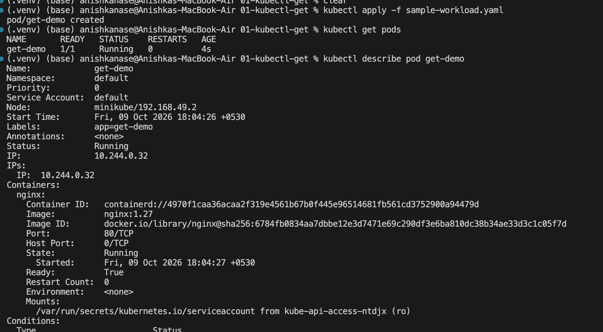
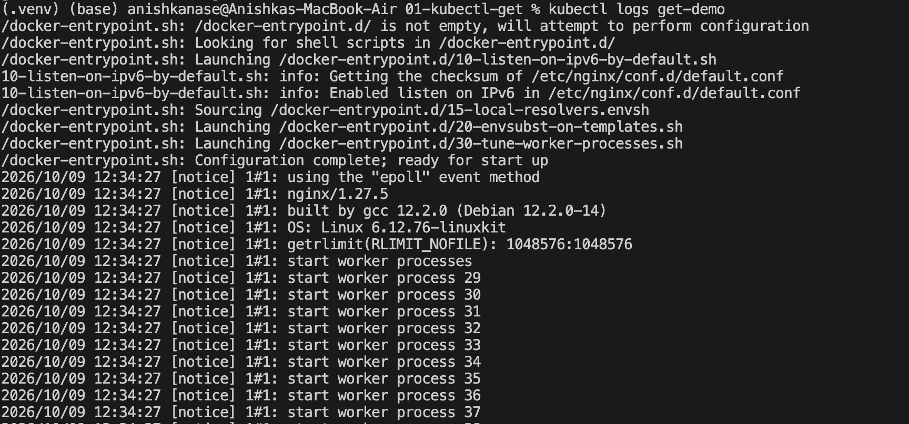
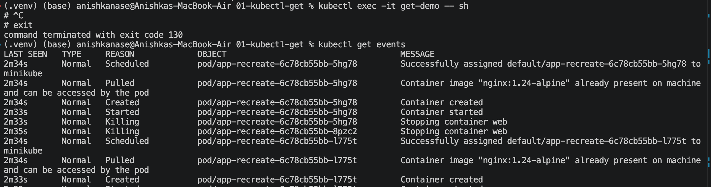
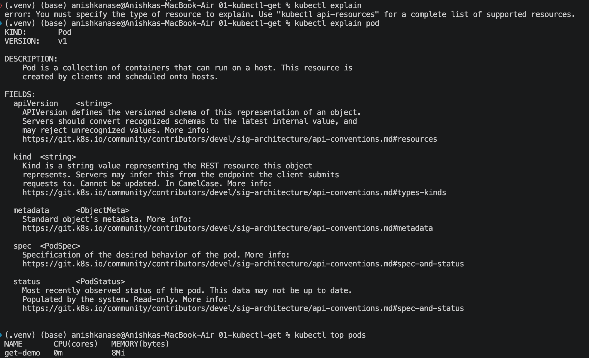
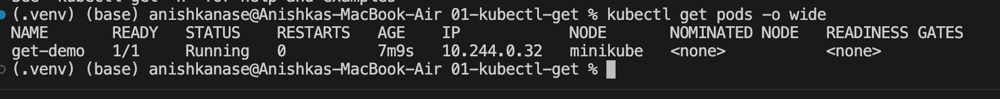
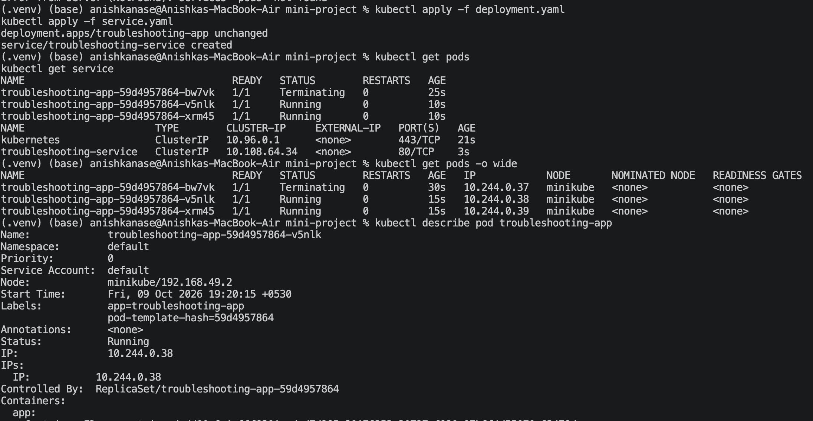
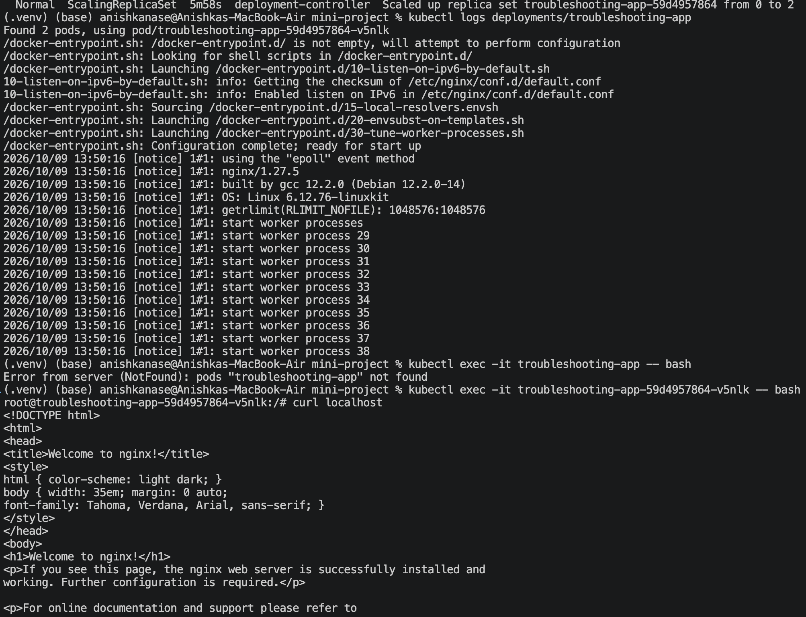
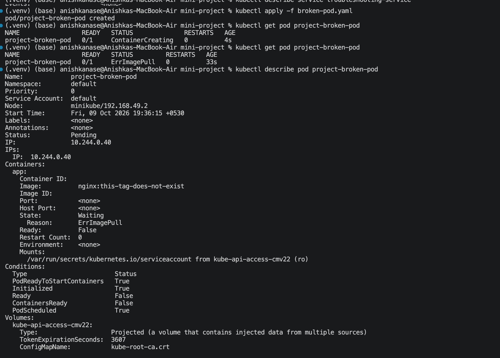
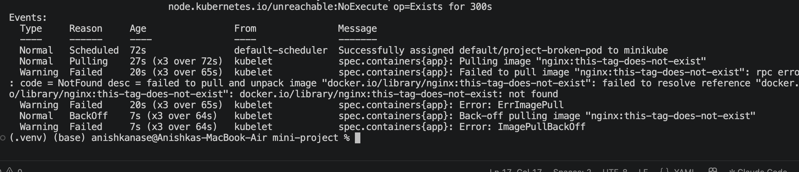
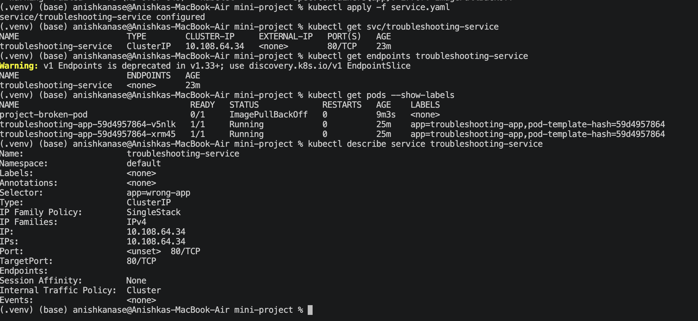

Identify the problem.
Investigate.
Find the root cause.
Fix it.
Verify the solution.
Document the troubleshooting process.

CrashLoopBackOff: When pod runs but it gets crashed, then Kubernetes retries it and this goes on, then Kubernetes will give error of CrashLoopBackOff.
exit 1 was issue in pod.yml => change it to sleep 3600

ImagePullBackOff: When we give a wrong image name in the yml file or we get rate limited, or network issue, Kubernetes again here will retry and back off by giving ImagePullBackOff error after a while. 

ErrImagePull: Error in pulling image, Kubernetes tries again by going in ImagePullBackOff

Pending: If u select a node via nodeSelector and provide a wrong node name, then this error comes. This error can be removed by removing the nodeSelector field. 
 

ContainerCreating: Container is getting created. 

CrashLoopBackOff: When a container repeatedly crashes, Kubernetes restarts it and gradually increases the waiting time between retries. In our example, exit 1 caused the container to terminate with an error. Fix it by replacing exit 1 with sleep 3600 in pod.yaml. Verify using kubectl get pods and check that the Pod stays Running.

ImagePullBackOff: This occurs when Kubernetes cannot pull the specified container image and starts waiting longer between retries. Common causes include an incorrect image name or tag, network issues, rate limits, or authentication problems. Fix it by correcting the image name or resolving the underlying issue. Verify using kubectl get pods and confirm that the Pod reaches Running.

ErrImagePull: This indicates that Kubernetes failed to pull the container image. For example, the image name or tag in the YAML file might not exist. Fix it by specifying a valid image and applying the corrected configuration. Verify using kubectl describe pod <pod-name> and check that the image pulls successfully.

Pending: A Pod remains Pending when Kubernetes cannot schedule it onto a suitable node. In our example, the nodeSelector specified a node name that does not exist. Fix it by removing the incorrect nodeSelector field from the YAML file. Verify using kubectl get pods -o wide and confirm that the Pod reaches Running.

ContainerCreating: This status means Kubernetes is preparing the container, such as setting up networking, mounting volumes, or pulling the image. It is a normal temporary status, but it may indicate a problem if it persists for too long. Investigate using kubectl describe pod <pod-name> and check the Events section for errors. Fix the underlying issue, then verify using kubectl get pods that the container starts successfully.

Service connectivity issues: When the service selector app name do not have any matching label Pod names, then we get this error. So the Service finds no matching Pods. And kubectl get endpoints <svc-name> shows no results. 

DNS issues: When a Pod uses an incorrect Service name or namespace, DNS resolution fails. Check the correct Service name and namespace using kubectl get svc -A. Fix the DNS name to <service-name>.<namespace>.svc.cluster.local. Verify using nslookup <service-name>.<namespace>.svc.cluster.local from a DNS test Pod.

Pod networking issues: When Pods cannot communicate with each other or a Service, a networking issue may exist. Check whether the Pods are running, ready, and whether the Service has endpoints. Verify the Service's port, targetPort, and any NetworkPolicy rules. Fix the incorrect configuration and test connectivity using curl from a Pod.

Configuration issues: Missing or incorrect environment variables, ConfigMaps, or Secrets can cause an application to fail. For example, our application fails because the required DATABASE_URL variable is missing. Add the required variable to the Pod YAML and recreate the Pod. Verify using kubectl logs <pod-name> and check that the application starts successfully.

Question 1: What is the Pod status?
Answer: ImagePullBackOff 

Question 2: What is the actual error?
Answer: ImagePullBackOff, Error is that the image given doesnt exist, Kubernetes is unable to pull the specified container image.

Question 3: Which command helped you find the reason?
Answer: kubectl get pod project-broken-pod and kubectl describe pod project-broken-pod — the Events section shows the image-pulling error.

Question 4: What is wrong with the image?
Answer: The YAML specifies nginx:this-tag-does-not-exist, which uses an invalid or nonexistent image tag.

Question 5: How would you fix it?
Answer: Replace the invalid image with a valid one, such as nginx:1.27, then recreate the Pod and verify using kubectl get pods.

Service with wrong selector

1. What does kubectl get tell us? 
Shows the status and basic information about Kubernetes resources.

2. Difference between get and describe? 
get shows a summary; describe shows detailed information and events.

3. Why use kubectl logs? 
To see application output and error messages.

4. When use kubectl exec? 
To run commands or open a shell inside a running container.

5. What is CrashLoopBackOff? 
The container repeatedly crashes, and Kubernetes retries with increasing wait times.

6. What is ImagePullBackOff? 
Kubernetes cannot download the specified container image and retries with increasing delays.

7. Why can a Pod remain Pending? 
Kubernetes cannot schedule it, often due to insufficient resources or an incorrect nodeSelector.

8. Why can a Service have no endpoints? 
Its selector does not match any eligible, ready Pods.

9. Relationship between Service selectors and Pod labels? 
The Service selector matches Pod labels to identify which Pods receive traffic.

10. What is Kubernetes DNS? 
It lets applications find Services using their names instead of IP addresses.